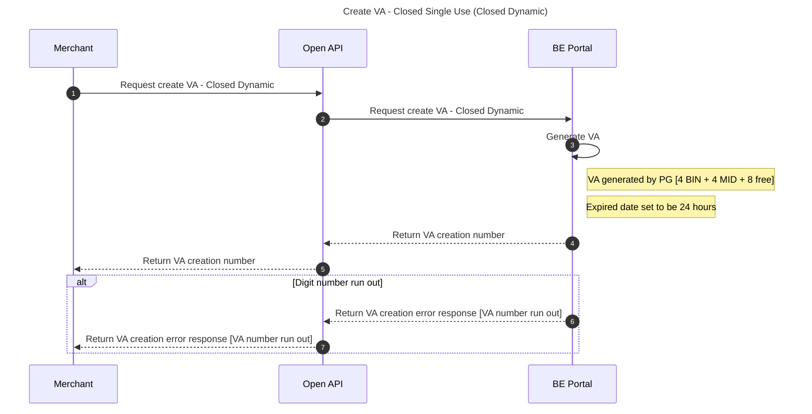

```mermaid
sequenceDiagram
    autonumber
    title: Create VA - Closed Single Use (Closed Dynamic)
    participant a as Merchant
    participant b as Open API
    participant c as BE Portal
    a->>b : Request create VA - Closed Dynamic
    b->>c : Request create VA - Closed Dynamic
    c->>c : Generate VA
    note right of c : VA generated by PG [4 BIN + 4 MID + 8 free]
    note right of c : Expired date set to be 24 hours
    c-->>b : Return VA creation number
    b-->>a : Return VA creation number
    alt Digit number run out
    c-->>b : Return VA creation error response [VA number run out]
    b-->>a : Return VA creation error response [VA number run out]
    end
```
