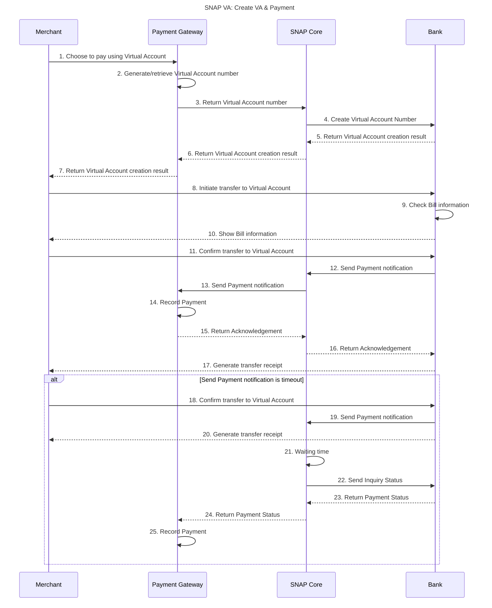

# SNAP VA: Create VA and Payment

```mermaid
sequenceDiagram
    title: SNAP VA: Create VA & Payment
    participant a as Merchant
    participant b as Payment Gateway
    participant c as SNAP Core
    participant d as Bank
   
    a->>b: 1. Choose to pay using Virtual Account
    b->>b: 2. Generate/retrieve Virtual Account number
    b->>c: 3. Return Virtual Account number
    c->>d: 4. Create Virtual Account Number
    d-->>c: 5. Return Virtual Account creation result
    c-->>b: 6. Return Virtual Account creation result
    b-->>a: 7. Return Virtual Account creation result
    a->>d: 8. Initiate transfer to Virtual Account
    d->>d: 9. Check Bill information
    d-->>a: 10. Show Bill information
    a->>d: 11. Confirm transfer to Virtual Account
    d->>c: 12. Send Payment notification
    c->>b: 13. Send Payment notification
    b->>b: 14. Record Payment
    b-->>c: 15. Return Acknowledgement
    c-->>d: 16. Return Acknowledgement
    d-->>a: 17. Generate transfer receipt
       
    alt Send Payment notification is timeout
        a->>d: 18. Confirm transfer to Virtual Account
        d->>c: 19. Send Payment notification
        d-->>a: 20. Generate transfer receipt
        c->>c: 21. Waiting time 
        c->>d: 22. Send Inquiry Status
        d-->>c: 23. Return Payment Status
        c-->>b: 24. Return Payment Status
        b->>b: 25. Record Payment
    end
```
