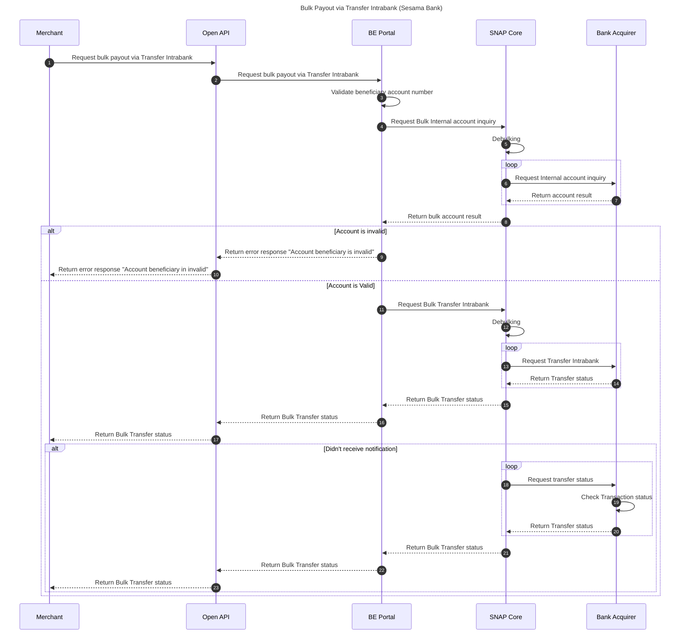

```mermaid
sequenceDiagram
    autonumber
    title: Bulk Payout via Transfer Intrabank (Sesama Bank)
    participant a as Merchant
    participant b as Open API
    participant c as BE Portal
    participant d as SNAP Core
    participant e as Bank Acquirer

    a->>b: Request bulk payout via Transfer Intrabank
    b->>c: Request bulk payout via Transfer Intrabank
    c->>c: Validate beneficiary account number 
    c->>d: Request Bulk Internal account inquiry
    d->>d: Debulking
    loop
    d->>e: Request Internal account inquiry
    e-->>d: Return account result
    end
    d-->>c: Return bulk account result
    alt Account is invalid
    c-->>b: Return error response "Account beneficiary is invalid"
    b-->>a: Return error response "Account beneficiary in invalid"
    else Account is Valid
    c->>d: Request Bulk Transfer Intrabank
    d->>d: Debulking
    loop
    d->>e: Request Transfer Intrabank
    e-->>d: Return Transfer status
    end
    d-->>c: Return Bulk Transfer status
    c-->>b: Return Bulk Transfer status
    b-->>a: Return Bulk Transfer status
        alt Didn't receive notification
        loop
        d->>e: Request transfer status
        e->>e: Check Transaction status
        e-->>d: Return Transfer status
        end
        d-->>c: Return Bulk Transfer status
        c-->>b: Return Bulk Transfer status
        b-->>a: Return Bulk Transfer status
        end
    end
```
